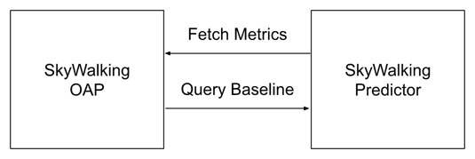

# Overview

SkyWalking Predictor is an open-source dynamic baseline generator that collects historical data 
from SkyWalking OAP and predicts metric data for a future period.

## Why use SkyWalking Predictor?

In the SkyWalking alert system, alerts can only be configured using predefined fixed values (thresholds). 
However, in real-world scenarios, thresholds often change over time.
For example, the system's CPU usage during the morning is significantly different 
from the peak business hours during the day. 
This makes dynamic baseline prediction particularly important.

The SkyWalking Predictor service can periodically collect metric data 
from the SkyWalking service and predict metric values for a future period.

## Architecture

- **Predictor**: Fetch data from OAP and provides a gRPC API for querying predicted metric values.
- **OAP**: It provides a data query protocol and periodically retrieves predicted data from the Predictor, 
integrating it into the alert module.
